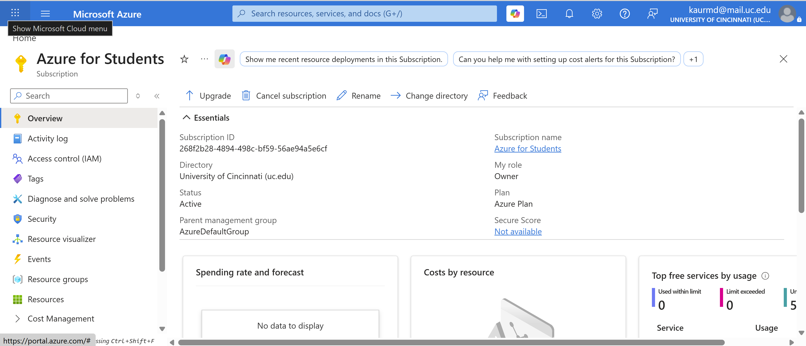
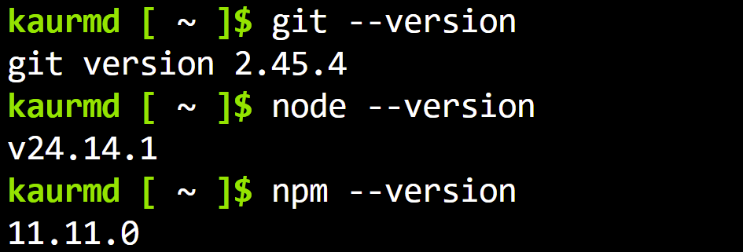
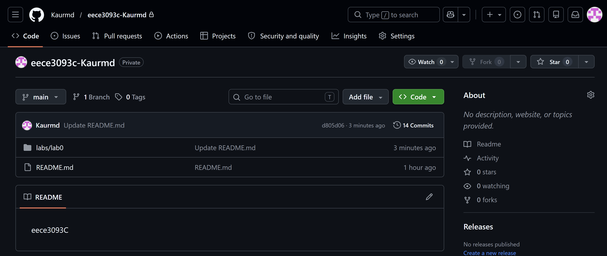
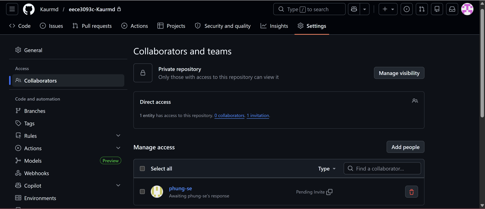
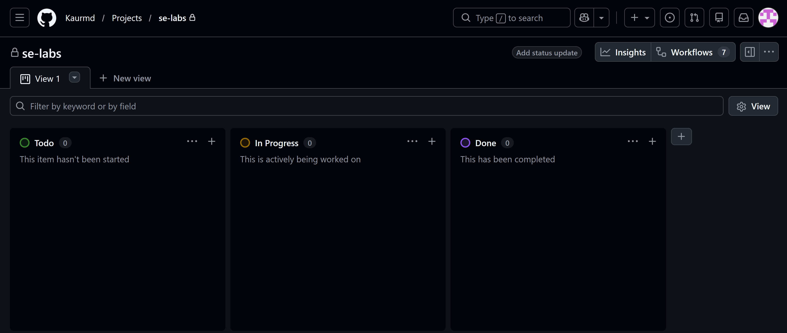
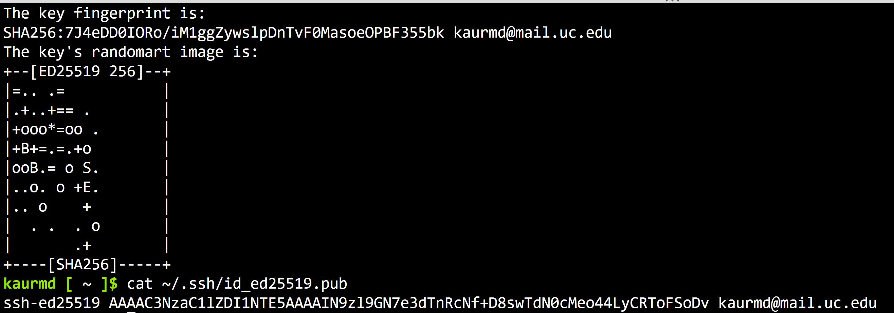
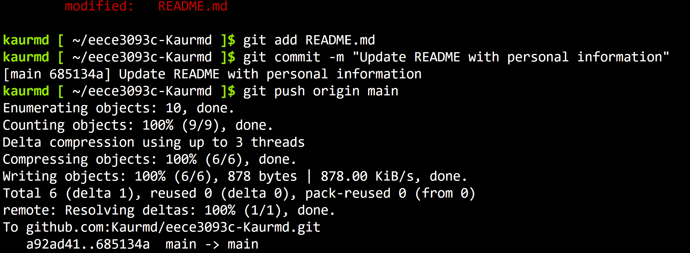
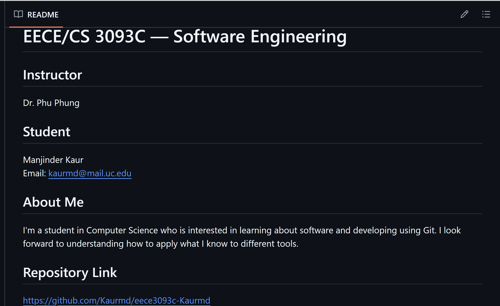

# EECE 3093C — Lab 0 Report

- **Course:** EECE 3093C / CS 3093C — Software Engineering, Summer 2026
- **Instructor:** Dr. Phu Phung
- **Name:** Manjinder Kaur
- **UC Email:** Kaurmd@mail.uc.edu
- **Repository:** https://github.com/Kaurmd/eece3093c-Kaurmd

---

## The lab's overview

This lab was an introduction to the tools that will be used throughout this course, which include Microsoft Azure, Git, and GitHub. The sub-tasks included checking the version of Cloud Shell, ensuring grading access to the repository is correct, then generating an SSH key within Cloud Shell. This then allowed for the connection to GitHub to clone the repository and edit the README file, therefore successfully pushing the update to GitHub. 

Direct link to lab folder: https://github.com/Kaurmd/eece3093c-Kaurmd/tree/main/labs/lab0

## Part I — Microsoft Azure for Students and Azure Cloud Shell

### Azure subscription

Markdown working example via:

### Cloud Shell version check

## Part II — GitHub Account and Private Repository

### Private repository

### phung-se invited as collaborator

### Projects permission check

## Part III — git Exercises

### SSH key generated

### Push success

### README rendered

